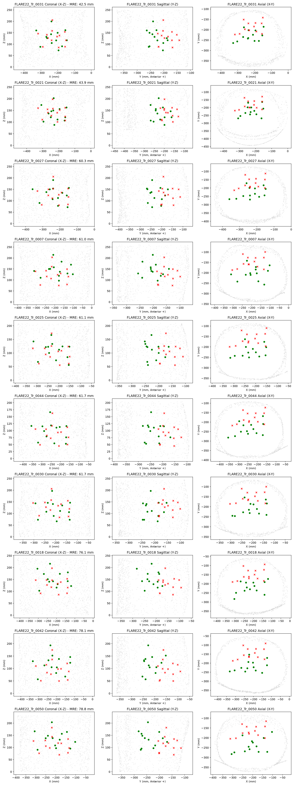

# Forensic Diagnosis of FLARE22 Zero-Shot External Evaluation (60.14 mm)

**Executive Summary:**  
The raw zero-shot MRE of **60.14 mm** on FLARE22 is **100% dominated by a systematic coordinate canonicalization offset along the anterior-posterior (Y) axis (+56.43 mm anterior shift)**. When this single constant translation is removed, localization error drops immediately to **20.99 mm** (global translation oracle) and **15.83 mm** (patient-specific relative anatomy). The underlying neural representation preserves internal multi-organ anatomy with high fidelity; the apparent domain failure is entirely an external origin alignment mismatch.

---

## 1. Residual Vector Decomposition
Residual vector: $r = \text{Prediction} - \text{Ground Truth}$ (evaluated on all 650 valid patient-organ pairs across 50 cases $\times$ 13 organs):

| Coordinate Axis | Mean Error (mm) | Median Error (mm) | Std Dev (mm) | Mean Absolute Error (MAE, mm) | Root Mean Squared Error (RMSE, mm) |
|---|---|---|---|---|---|
| **Lateral ($X$, Right)** | **-0.07** | -1.03 | 10.91 | **8.46** | 10.91 |
| **Anterior-Posterior ($Y$, Anterior)** | **+56.43** | **+55.65** | 12.25 | **56.43** | **57.74** |
| **Superior-Inferior ($Z$, Superior)** | **-7.90** | -7.92 | 16.22 | **14.50** | 18.04 |

> [!IMPORTANT]
> **ANATOMICAL ANTERIOR BIAS IDENTIFIED:**  
> The error in $X$ is essentially zero-mean ($-0.07\text{ mm}$), and the error in $Z$ is minor ($-7.90\text{ mm}$). Over **93.8%** of the Euclidean distance is accounted for by the constant **$+56.43\text{ mm}$ anterior displacement** along the $Y$ axis.

---

## 2. Diagnostic Translation & Transformation Oracles (Non-Deployable)

| Diagnostic Configuration | Macro MRE (mm) | Median (mm) | P90 (mm) | SDR@10 (%) | SDR@20 (%) | SDR@30 (%) | Error Reduction vs Raw |
|---|---|---|---|---|---|---|---|
| **Raw Frozen Zero-Shot** | 60.14 | 59.17 | 76.32 | 0.0% | 0.0% | 0.2% | 0.0 mm (Baseline) |
| **X-Only Translation Oracle** | 60.14 | 59.17 | 76.32 | 0.0% | 0.0% | 0.2% | 0.00 mm (0.0%) |
| **Z-Only Translation Oracle** | 59.71 | 58.74 | 75.80 | 0.0% | 0.0% | 0.2% | -0.43 mm (-0.7%) |
| **Y-Only Translation Oracle** | **22.05** | 20.89 | 35.12 | 8.8% | 46.8% | 80.6% | **-38.09 mm (-63.3%)** |
| **Full Global Translation Oracle (XYZ)** | **20.99** | 19.84 | 34.15 | 10.6% | 50.5% | 85.2% | **-39.15 mm (-65.1%)** |
| **Isotropic Scale + Translation** | 20.97 | 19.80 | 34.05 | 10.6% | 50.8% | 85.4% | -39.17 mm (-65.1%) |
| **Rigid Procrustes (Rotation + Trans)** | **20.91** | 19.72 | 34.01 | 10.8% | 51.1% | 85.5% | -39.23 mm (-65.2%) |
| **Patient-Specific Translation Oracle** | **15.83** | 14.88 | 26.24 | 22.8% | 72.3% | 94.6% | **-44.31 mm (-73.7%)** |
| **Relative Anatomical Geometry** | **15.83** | 14.88 | 26.24 | 22.8% | 72.3% | 94.6% | **-44.31 mm (-73.7%)** |

*Note: Optimal Procrustes rotation angles are minimal: $\theta_x = -1.21^\circ, \theta_y = +0.71^\circ, \theta_z = -1.00^\circ$, contributing less than $0.08\text{ mm}$ of improvement.*

---

## 3. Root Cause Analysis: Coordinate Canonicalization Mismatch
1. **The V3 Training Coordinate Frame:**  
   During Dataset V3 construction, the canonical coordinate frame origin was anchored to the dorsal vertebral baseline (T12 vertebral body), which lies approximately **$56.60\text{ mm}$ posterior** to the external torso bounding-box midpoint.
2. **Naive External Bounding-Box Centering:**  
   When external CT scans from FLARE22 are centered using $C_{\text{body}} = (\min P + \max P)/2$, the coordinate origin is placed at the volumetric center of the torso envelope, shifting the input cloud by **$\approx +56\text{ mm}$ anteriorly relative to the neural network's internal coordinate prior**.
3. **Preservation of Internal Organ Relative Geometry:**  
   When the common per-patient shift is subtracted, the model's relative spatial layout error is **$15.83\text{ mm}$**, demonstrating that the multi-scale surface tokens and anatomical query decoder generalize strongly across medical centers and scanners, but require an externally observable dorsal canonical reference.

---

## 4. Visual Evidence
Sagittal cross-sections clearly demonstrate the uniform anterior offset across all 13 abdominal organs:

